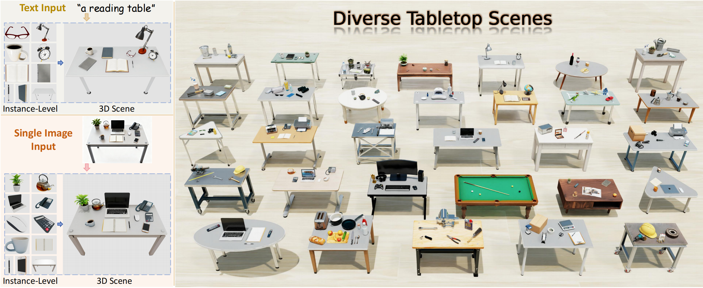

<div align="center">

<h1><span style="color: #FF8C00;">T</span>abletopGen: Tabletop Scene <span style="color: #800080;">Gen</span>eration and Interactive Simulation for Robotic Manipulation</h1>
<div style="font-size: 1.3em; font-weight: bold; margin-top: -0.6em; margin-bottom: 0.8em;">ECCV 2026</div>



<br>

<div style="font-size: 1.5em;">
    <strong>Ziqian Wang</strong><sup>1,3,2</sup>,
    <strong>Yonghao He</strong><sup>2†</sup>,
    <strong>Licheng Yang</strong><sup>1,3</sup>,
    <strong>Wei Zou</strong><sup>1,3</sup>,
    <strong>Hongxuan Ma</strong><sup>3</sup>,
    <strong>Liu Liu</strong><sup>4</sup>,
    <br>
    <strong>Wei Sui</strong><sup>2✉</sup>,
    <strong>Yuxin Guo</strong><sup>1,3</sup>,
    <strong>Hu Su</strong><sup>3✉</sup>
</div>

<br>

<div style="text-align: center;font-size: 1.5em;">
    <sup>1</sup>School of Artificial Intelligence, University of Chinese Academy of Sciences<br>
    <sup>2</sup>D-Robotics<br>
    <sup>3</sup>State Key Laboratory of Multimodal Artificial Intelligence Systems (MAIS), <br> Institute of Automation, Chinese Academy of Sciences<br>
    <sup>4</sup>Horizon Robotics
</div>

<div style="font-size: 1.5em;font-weight: bold;">
    <sup>†</sup><u>Project Leader</u> &emsp; <sup>✉</sup><u>Corresponding author</u>
</div>

<br>

<a href="https://arxiv.org/abs/2512.01204"></a>
<a href="https://arxiv.org/pdf/2512.01204"></a>
<a href="https://d-robotics-ai-lab.github.io/TabletopGen.project/"></a>
<a href="https://huggingface.co/datasets/xinjue1/TabletopGen-Assets"></a>

<br>

<div align="center">
<video src="https://github.com/user-attachments/assets/d266a7bd-308b-4f45-8733-5b5ccf227bc2" controls width="80%"></video>
</div>

</div>

## 🎉 Updates

- **[2026-06-18]** 🎉 TabletopGen has been accepted to **ECCV 2026**!
- **[2025-12-30]** 🤖 We have released the **Robotic Manipulation Demo** code and assets on [Hugging Face](https://huggingface.co/datasets/xinjue1/TabletopGen-Assets/tree/main/manipulation_demo).
- **[2025-12-30]** 🎨 A **Scene Gallery** containing diverse generated 3D tabletop scenes (GLB format) is now available on [Hugging Face](https://huggingface.co/datasets/xinjue1/TabletopGen-Assets/tree/main/scene_gallery).
- **[2025-12-10]** 🎉 TabletopGen is now open source!

## 🧩 Abstract

Simulation provides a low-cost, scalable pathway to large-scale robotic manipulation data collection. However, existing 3D scene generation methods can rarely be applied directly to manipulation data synthesis, as their generated scenes often lack instance-level interactivity and physical plausibility.

Focusing on tabletop manipulation, we propose **TabletopGen**, a training-free and automated tabletop scene generation and interactive simulation engine. Starting from text or a single image, we first obtain independent 3D object models via generative instance extraction. Second, we introduce a novel pose and scale alignment approach that recovers a collision-free scene layout using a Differentiable Rotation Optimizer and a Top-View Spatial Alignment mechanism.

Finally, we assemble the generated scene in a physics simulator with collision geometry, yielding a stable, interactable environment for synthesizing multimodal manipulation data. Extensive experiments and user studies demonstrate that TabletopGen achieves state-of-the-art performance in visual fidelity, layout accuracy, and physical plausibility.

Furthermore, we validate the executability of the collected trajectories on a real robotic arm via zero-shot real-to-sim-to-real policy transfer, indicating that TabletopGen can serve as a reliable data engine for robotic manipulation data synthesis.


## 🎨 Scene Gallery

We release the **18 scenes** showcased on our project website for quick preview and testing. These models cover **diverse scene types** (e.g., office, dining, workshop) and **various styles** (e.g., realistic, cartoon).

| Description | Download |
| :--- | :---: |
| **Project Showcase Collection**<br>Contains all 18 high-fidelity interactive scenes featured on our website. | [**📂 Browse on Hugging Face**](https://huggingface.co/datasets/xinjue1/TabletopGen-Assets/tree/main/scene_gallery) |

> **Note:** All scenes are in `.glb` format with separated distinct instances, ready to be imported into 3D renderers for visualization or assigned physical properties for robotic simulation.

## 🚀 Installation


This project utilizes two distinct environments, **tabletopgen** and **rotation**, to handle complex dependencies.

We provide an automated setup workflow. You **do not** need to manually configure the two environments or compile dependencies one by one.

### 1. Clone the Repository
```bash
git clone https://github.com/D-Robotics-AI-Lab/TabletopGen.git
cd TabletopGen
```

### 2. One-Click Environment Setup
We provide a shell script that automatically:
1.  Creates the primary environment `tabletopgen` (CUDA 11.8, Torch 2.6).
2.  Compiles **Grounded-SAM-2** and installs **BiRefNet**.
3.  Creates the secondary environment `rotation` (CUDA 12.1, PyTorch3D).

**For Linux Users:**

Please export your local CUDA path before running the script (required for compiling Grounded-SAM-2):
```bash
# Replace with your own CUDA path (e.g., /usr/local/cuda-11.8)
export CUDA_HOME=/path/to/cuda-11.8 
bash install_env.sh
```
> ☕ **Note:** This process involves compiling CUDA extensions locally. It may take a few minutes depending on your network and CPU.

### 3. Download Model Weights
Run this script to automatically download the correct checkpoints for **BiRefNet**, **SAM 2.1**, and **Grounding DINO** to their respective directories.

```bash
# Activate the main environment first
conda activate tabletopgen

# Run the auto-download script
python install_scripts/download_weights.py
```

## 🛠️ Usage

### 1. Configuration
Before running the pipeline, please configure your API settings (e.g., OpenAI, Hunyuan3D, etc.) in the configuration file:
```yaml
# Edit this file with your own API settings
configs/config.yaml
```

### 2. Generate Input Image (Optional)
If you do not have an input image, you can generate one from text using `text2img.py`.
* **Arguments:**
    * `--doubao_api_key`: Your API key for the generation service.
    * `--text`: Description of the scene (e.g., "A hobby desk with some model cars and tools.").
    * `--id` (Optional): Manually specify the generated image ID. If omitted, it auto-increments.
* **Output:** Generated images will be saved in `scene_image/`.

```bash
conda activate tabletopgen
python text2img.py --doubao_api_key "YOUR_API_KEY" --text "A hobby desk with some model cars and tools."
```

### 3. Run Scene Generation Pipeline
Run the main pipeline to generate the 3D scene.

**Arguments:**
* `--input_image` (Required): Path to the input image file.
* `--scene_id` (Optional): Manually specify the Scene ID (directory name).
* `--skip_step` (Optional): Skip specific pipeline steps (space-separated integers). Useful for debugging or resuming.

**Example Commands:**

```bash
conda activate tabletopgen
python pipeline.py --input_image scene_image/scene_image_1.png

```

> 💡 **Critical Tip for Best Results:**
> In **Step 1** of the pipeline, we **strongly recommend** adjusting the Grounded-SAM-2 thresholds to ensure all object instances are correctly segmented and extracted.
> You can tweak the following parameters in the pipeline code:
> * `box_threshold`
> * `text_threshold`
> * `confidence_threshold`


### 4. Visualization & Simulation
**View GLB Model:**
Once the generation is complete, you can view the assembled 3D scene at:
`output_scene/scene_{id}/scene_{id}.glb`

**NVIDIA Isaac Sim (Physics-based Assembly):**
For a scene assembly with full physical properties, use the Isaac Sim script.
* **Prerequisite:** Ensure NVIDIA Isaac Sim is installed ([Installation Guide](https://docs.isaacsim.omniverse.nvidia.com/4.5.0/index.html)).

```bash
# Run the Isaac Sim visualization script
python isaac_final_scene.py
```

## 🤖 Downstream Application: Robotic Manipulation

To demonstrate the physical interactivity and realism of the generated scenes, we provide a **Pick-and-Place** demo using a Franka Emika Panda robot in NVIDIA Isaac Sim.

### Pick & Place Demo
This demo showcases the robot picking and placing generated objects within the `TabletopGen` scenes, verifying accurate collision meshes and physical properties.

**Get the Demo Kit:**
Due to the large size of simulation assets, the demo code and USD files are hosted externally.

[](https://huggingface.co/datasets/xinjue1/TabletopGen-Assets/tree/main/manipulation_demo)

**How to Run:**
1. Download the `manipulation_demo` folder from the link above.
2. Ensure **NVIDIA Isaac Sim** is installed.
3. Please refer to the detailed guide in `manipulation_demo/README.md` to run the following scripts:
   * **`pick_place.py`**: Run the interactive pick-and-place demo.
   * **`collect.py`**: Execute the data collection pipeline.

## 💬 Community & Discussion

Please scan the QR code to connect with us on WeChat and join the community for the latest updates and discussions with the authors.

<div align="center">
  
  <p>Scan to connect with us</p>
</div>

## 💝 Acknowledgments

We would like to express our gratitude to the following projects and services that made this work possible:

- [Grounded-SAM-2](https://github.com/IDEA-Research/Grounded-SAM-2).
- [BiRefNet](https://github.com/ZhengPeng7/BiRefNet).
- [Hunyuan3D](https://3d.hunyuan.tencent.com/).
- [Volcengine](https://www.volcengine.com/product/doubao).
- [Google AI Studio](https://aistudio.google.com/).
- [OpenAI](https://openai.com/).
- [OpenRouter](https://openrouter.ai/).

## 📝 Citation

If you use this code in your research, please cite our project:

```bibtex
@article{wang2025tabletopgen,
  title={TabletopGen: Instance-Level Interactive 3D Tabletop Scene Generation from Text or Single Image},
  author={Wang, Ziqian and He, Yonghao and Yang, Licheng and Zou, Wei and Ma, Hongxuan and Liu, Liu and Sui, Wei and Guo, Yuxin and Su, Hu},
  journal={arXiv preprint arXiv:2512.01204},
  year={2025}
}
```
